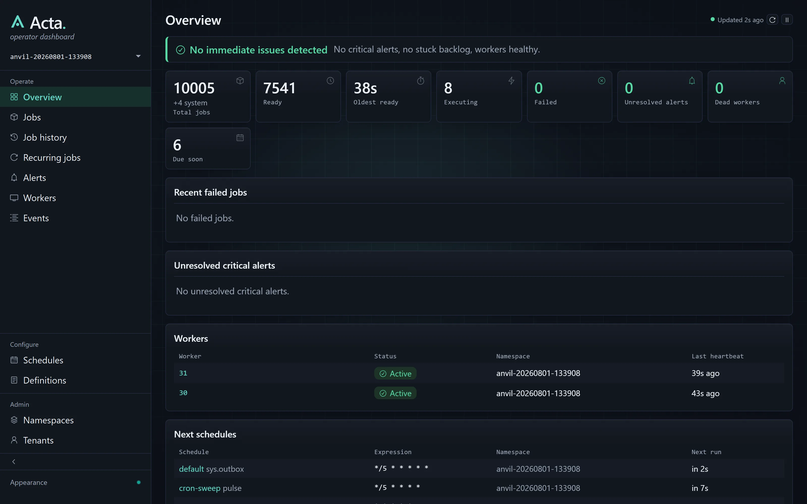

# Acta

**Kill the worker. Keep the work.** Acta is the durable work ledger for .NET: background jobs with named checkpoints, SQL-visible state, and operator control.

[](https://github.com/acta-dotnet/acta/actions/workflows/ci.yml)
[](https://www.nuget.org/packages/Acta)
[](./LICENSE)
[](https://useacta.net/)

> **Serious early preview.** Acta is an early preview of a SQL-native durable work ledger for .NET. It is published for evaluation and design feedback, not recommended for production workloads yet, and APIs, schema, and behavior may change without deprecation.

Acta records jobs, retries, schedules, checkpoints, events, workers, and operator controls in your database. It gives .NET teams one standard substrate for app-owned background work: simple enough for scheduled jobs, durable enough for retries and recovery, and visible because every state transition is ordinary SQL state you can inspect with `SELECT`.

> **See the model work.** [`Acta Engineering Labs`](./docs/engineering-labs.md) is the hands-on field guide:
> run crash recovery, durable steps, signals, schedule cursors, Explain, and operator controls, then
> inspect the exact rows and source behind each behavior.

The core model is implemented: durable jobs, retries, schedules, steps, signals, sleeps, child jobs, operator queries, dashboard/API, CLI, testing support, and SQL providers. Execution is **at-least-once**: Acta makes durable state repeat-safe, and handlers own idempotency for external side effects.

No broker required. No sidecar. No hosted control plane. No deterministic replay engine. No hidden work state.

Most teams do not need another scheduler choice. They need one clear way for app-owned work to
happen later or repeatedly without becoming hidden state. Use `BackgroundService`, cron, Task
Scheduler, platform jobs, or timers for disposable local loops. Use Acta when the work needs durable
state, retries, audit, recovery, and operator control in your own SQL database. See
[`docs/choosing-acta.md`](./docs/choosing-acta.md) for the decision guide.

## Quickstart

In your own app, from an empty folder. The only prerequisite is the [.NET 10 SDK](https://dotnet.microsoft.com/download/dotnet/10.0): no Docker, no database server, no connection string. Everything below runs on embedded SQLite.

```bash
dotnet new console -n Shipping && cd Shipping
dotnet add package Acta.Sqlite --prerelease
dotnet add package Microsoft.Extensions.Hosting
```

Replace `Program.cs` with this, all of it:

```csharp
using Shipping;                 // the generated manifest lands in your project's root namespace
using Acta;
using Acta.Sqlite;
using Microsoft.Extensions.DependencyInjection;
using Microsoft.Extensions.Hosting;

var builder = Host.CreateApplicationBuilder(args);

builder.Services.UseActa(j =>
{
    j.UseSqlite(sqlite =>
    {
        sqlite.ConnectionString = "Data Source=acta-local.db";
        sqlite.ApplyMigrationsOnStartup = true;   // dev convenience; run from a deploy step in production
    });
    j.Run<ShippingJobs>("shipping");
});

using var host = builder.Build();
await host.StartAsync();

var jobs = host.Services.GetRequiredService<IJobs>();
await jobs.EnqueueAsync(new ShipOrder(1042));

Console.WriteLine("Enqueued. Ctrl+C to stop.");
await host.WaitForShutdownAsync();

public sealed record ShipOrder(int OrderId);

public static class ShippingHandlers
{
    [Job("ship-order")]
    public static void Handle(ShipOrder input) => Console.WriteLine($"Shipping order {input.OrderId}");
}
```

```bash
dotnet run
# Enqueued. Ctrl+C to stop.
# Shipping order 1042
```

The job is a row in `acta-local.db` before it is a method call. `ShippingJobs` is source-generated from your `[Job]` handlers: one manifest per project, named after your root namespace, registered once. One worker runtime owns one namespace, and the host that enqueues can also execute, so there is no separate worker process to deploy unless you want one. Swap `UseSqlite` for `UsePostgres` or `UseSqlServer` and nothing else changes.

Full walkthrough: [`docs/quickstart.md`](./docs/quickstart.md). Deeper docs start at [`docs/README.md`](./docs/README.md).

### Or explore the repository

88 runnable concept projects and the load-and-failure lab, if you would rather read the model than wire it up:

```bash
git clone https://github.com/acta-dotnet/acta && cd acta
dotnet run --project tools/Acta.Doctor        # optional preflight: SDK, SQLite, Docker, ports, env vars
dotnet run --project concepts/000-fundamentals/001-hello-acta   # first concept: enqueue a job, watch a worker run it
dotnet run --project anvil/Anvil    # lab UI + Acta dashboard at http://127.0.0.1:5059/acta
```

The Anvil step builds the dashboard UI, which needs Node.js 20+ on PATH once; without Node the first two commands still run.

The `[Job]` name is the durable, operator-facing contract: it is what the row carries, what the dashboard shows, and what you must not rename casually. Enqueue is typed; dispatch is generated.

SQLite state is one file. The quickstart writes `acta-local.db` beside your project; the bundled concepts write `acta-local*.db` to your temp directory (`%TEMP%` on Windows, `$TMPDIR` or `/tmp` elsewhere) - delete it to reset. Smoke-run every non-interactive concept: `dotnet run --project tools/Acta.Doctor -- smoke`. Docker is optional, only needed to run against real Postgres / SQL Server / Redis: setup, tests, and benchmarks in [`CONTRIBUTING.md`](./CONTRIBUTING.md); environment problems in [`docs/guide/troubleshooting.md`](./docs/guide/troubleshooting.md).

## Use Acta when

- You already run SQL Server, PostgreSQL, or SQLite.
- You want durable background jobs without adding a broker.
- You want job state inspectable with SQL.
- You need retries, delays, schedules, and operator controls.
- You want deterministic tests around job behavior.
- You want a local dashboard/API for operations.

## Do not use Acta when

- You need deterministic workflow replay.
- You need a general-purpose message bus.
- You need Kafka-style streaming.
- You need BPMN or visual workflow modeling.
- You want a hosted orchestration control plane.
- Your external side effects cannot tolerate duplicate attempts, be made idempotent, or be reconciled with `AtMostOnce()` step semantics.

## See your work

There is no proprietary console and no hidden state to decode. Jobs, leases, attempts, events, schedules, checkpoints, alerts, and workers are rows; common reads start from curated operator views:



```sql
-- In-flight work and who holds it.
select job_id, job_ref, namespace, job_name, status, leased_by_worker_id, leased_by_worker_host, lease_expires_at_utc
from acta.jobs_view
where status in ('dispatched', 'executing');
```

More shapes (backlogs, stuck jobs, worker liveness, pending alerts) in [`docs/guide/sql-recipes.md`](./docs/guide/sql-recipes.md); the numeric codes decode via [`docs/reference/code-families.md`](./docs/reference/code-families.md). Because state is rows, a job that failed a month ago is still there to inspect, and to restart with its original input.

## Capabilities and boundaries

**You get:**

- Fire-and-forget, delayed, and recurring jobs; durable retries with typed backoff.
- Named run-once steps, durable sleeps, signals into suspended jobs, child jobs with fan-out / fan-in, result retrieval, and job lineage.
- An append-only SQL event ledger, and transactional enqueue that joins a caller-owned `DbTransaction` (plus an external EF Core outbox for atomic handoff from a different database).
- A test host that drives the real runtime one deterministic tick at a time: no sleeps, no polling, real-database tests in tens of milliseconds.
- A control CLI in every host, including `jobs debug` to claim any persisted job and step through its handler under a breakpoint.
- An optional operator dashboard/query API whose mutating controls are explicitly enabled.

**You do not get:** deterministic event-history replay, BPMN or a visual workflow designer, a message bus, a sidecar, a hosted control plane, or workflow SaaS orchestration.

The execution model is **checkpoints, not replay**: a handler may re-enter from the top after a crash or suspend, but completed durable slots do not repeat their work. This keeps Acta-owned state repeat-safe; external side effects still need idempotency. The hot path stays close to the metal: source-generated dispatch with no reflection, one SQL round-trip per state change.

## Documentation

Start with the guides in [`docs/`](./docs/README.md): choosing Acta, quickstart, the Acta Engineering Labs field guide, scheduler migration, concepts and vocabulary, the handler contract, production guide, contract evolution, and the operator guide. The generated references (data model, code families, conformance contracts) sit behind them for lookup, drift-checked against source in CI.

## Packages

**NuGet packages** (published on [nuget.org](https://www.nuget.org/packages?q=Acta) since `0.3.0-alpha.1`): `Acta.SqlServer`, `Acta.Postgres`, `Acta.Sqlite` (providers, one reference is enough), `Acta` (public API + SDK), `Acta.Runtime` (runtime implementation), `Acta.Relational` (shared relational mechanics, a transitive dependency of the providers), `Acta.AspNetCore` (dashboard + JSON API), `Acta.Redis` (optional worker wakeup), `Acta.Testing` (test host). Transactional cross-database outbox staging (the `AddToActaOutboxAsync` producer primitive) ships inside each provider package, not as a separate reference. Source-generated dispatch (`Acta.Generators`) ships bundled inside these: there is no separate reference.

**Repository tooling** (not published to NuGet): `Acta.Emit` (doc/migration emitter) and `Acta.Doctor` (environment preflight and SQLite sample smoke), run with `dotnet run --project tools/…`.

## Status

- The migration history freezes at 1.0.0, and only then: before it, the schema baseline (`M001`) may be re-cut in any release. From 1.0.0 schema changes ship only as additive `Mnnn` migrations. During the preview, upgrade compatibility between preview builds is not promised: a schema-incompatible preview update means dropping and reprovisioning the Acta database, and the bootstrap refuses to run rather than applying a mismatched baseline.
- Acta ships no login system. The dashboard and HTTP API are local-only by default, and control verbs are disabled by default: see [`docs/guide/operator-guide.md`](./docs/guide/operator-guide.md#security-and-exposure) before exposing anything.
- Known limitations are tracked in [`docs/technical/known-limitations.md`](./docs/technical/known-limitations.md).
- The supported .NET target, provider tiers, packages, and patch policy are stated in [`docs/support.md`](./docs/support.md).

## How this was built

The inner core is the author's. The data model, the execution semantics, the claim and lease
machinery, and every public API signature are deliberate human decisions, defensible column by
column and method by method. AI was used heavily, and deliberately, on the outer core: test
scaffolding, documentation, consistency sweeps, benchmark tooling. Every line passed the same gates
either way: ~3,200 tests on three databases, a conformance contract, drift-checked generated docs,
recorded benchmark baselines. AI made the work faster. It did not make the decisions.

## License

Apache-2.0. The runtime, dashboard, CLI, and official SQL providers are free. See [`LICENSE`](./LICENSE).
