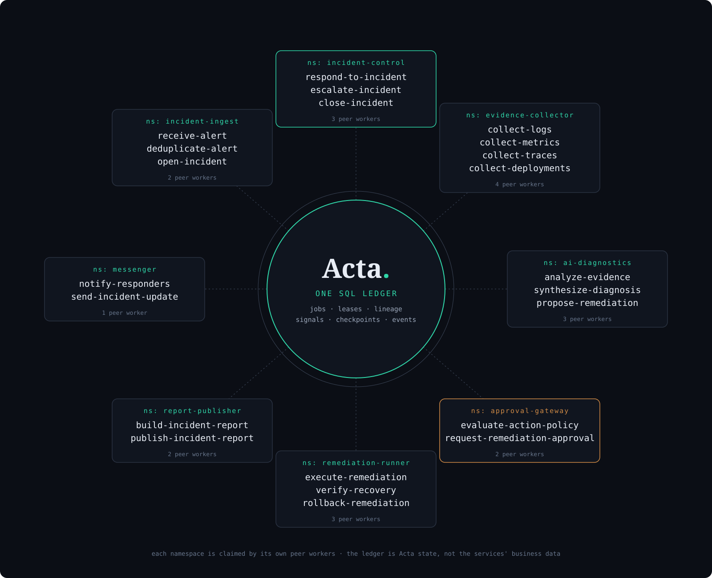

# AI incident-response system powered by Acta

> Design only: no runnable implementation exists yet. A possible future reference demo, not a bundled Acta product or a roadmap commitment.

The demo would show a limited incident-response copilot on Acta's durable job infrastructure. It would demonstrate why AI-assisted operations need durable state, parallel work, failure recovery, human signals, and an audit trail, not claim that AI can operate production safely by itself.

## The scenario

A sample commerce system contains a gateway, checkout, inventory, payments, and messenger services. A deliberately bad checkout deployment exhausts its database connection pool. Error rate and latency rise, and monitoring sends an alert with the affected service, environment, time window, and telemetry links.

The system deduplicates the alert using the detector's incident key and creates one durable `respond-to-incident` root job. That job owns the incident until resolution or escalation, even if workers die or the demo is redeployed.

It starts evidence collection in parallel:

- `collect-logs` retrieves the relevant error window;
- `collect-metrics` captures latency, error rate, saturation, and connection-pool pressure;
- `collect-traces` finds slow and failed request paths;
- `collect-deployments` records what changed immediately before the alert.

A first implementation could use a reproducible observability bundle checked into the demo; an extended one might query local OpenTelemetry and Prometheus-compatible endpoints. The initial conclusions would therefore remain reliable and testable.

## Diagnosis and output

Focused AI diagnostic jobs analyze the evidence; they do not run an unrestricted autonomous loop. Each call returns structured data: a summary, ranked hypotheses, evidence references, proposed actions, and confidence. The root job checkpoints the result so another worker can resume without rebuilding an ever-growing chat transcript.

For the injected failure, the expected conclusion is that the checkout deployment caused connection-pool exhaustion. The system cites the deployment timestamp, first error spike, representative logs, and trace or metric evidence, then produces a bounded response plan and incident report.

A credible first implementation would stop there: propose an action, change nothing in the sample system.

## Service boundaries

Each deployable demo service owns one Acta namespace, and its replicas are peer workers rather than permanently assigned job executors. The ring above is this table: the root namespace (`incident-control`) in verdigris, the human gate (`approval-gateway`) in amber.

| Namespace | Responsibility | Main jobs |
| --- | --- | --- |
| `incident-ingest` | Accept and deduplicate alerts | `receive-alert`, `deduplicate-alert`, `open-incident` |
| `incident-control` | Own the durable incident state | `respond-to-incident`, `escalate-incident`, `close-incident` |
| `evidence-collector` | Collect telemetry and change history | `collect-logs`, `collect-metrics`, `collect-traces`, `collect-deployments` |
| `ai-diagnostics` | Produce evidence-backed conclusions | `analyze-evidence`, `synthesize-diagnosis`, `propose-remediation` |
| `approval-gateway` | Apply deterministic action policy | `evaluate-action-policy`, `request-remediation-approval` |
| `remediation-runner` | Run only predefined actions | `execute-remediation`, `verify-recovery`, `rollback-remediation` |
| `report-publisher` | Build and publish the audit report | `build-incident-report`, `publish-incident-report` |
| `messenger` | Notify responders without owning incident state | `notify-responders`, `send-incident-update` |

The shared SQL database is the Acta work ledger: jobs, leases, lineage, signals, checkpoints, and events. It is not a shared database for the sample services' business data.

## What Acta proves

The demo must prove failure handling, not merely complete a happy-path AI call. Evidence collectors run as cross-namespace child jobs and join into the root. Evidence and diagnosis are checkpointed. Killing a collector lets a peer reclaim its expired lease. A duplicate alert does not create another incident. The report identifies the jobs, failed attempts, evidence, and state transitions.

Acta's at-least-once execution remains explicit. Any later external action needs an idempotency key based on incident ID, action ID, and attempt, plus reconciliation for ambiguous outcomes.

## A realistic second phase

Only after the read-only demo is useful should it gain a tiny remediation catalogue: restart one unhealthy replica or roll back one known demo deployment. Deterministic policy classifies the action, the root waits for human approval without holding a worker, and the remediation service executes it. After a durable delay, `verify-recovery` checks error rate and latency. Failure leads to rollback or escalation, never an unconstrained sequence of AI-selected commands.

The demo succeeds if a visitor can inject the failure, kill workers during investigation, approve or reject a bounded action, and still receive one evidence-linked report with a complete SQL-visible history. The claim is not autonomous SRE; it is durable, inspectable execution for AI-assisted operational work.
