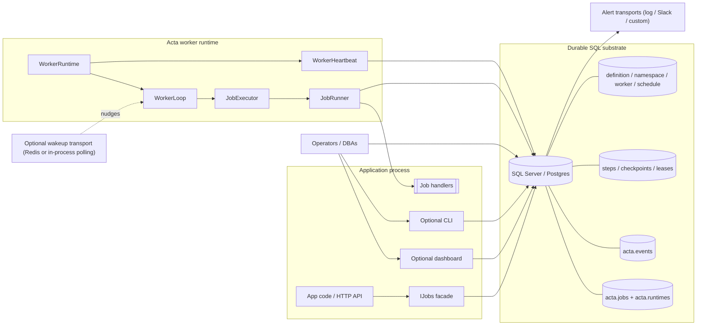
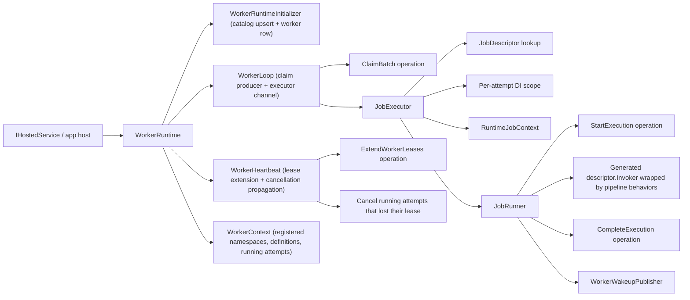
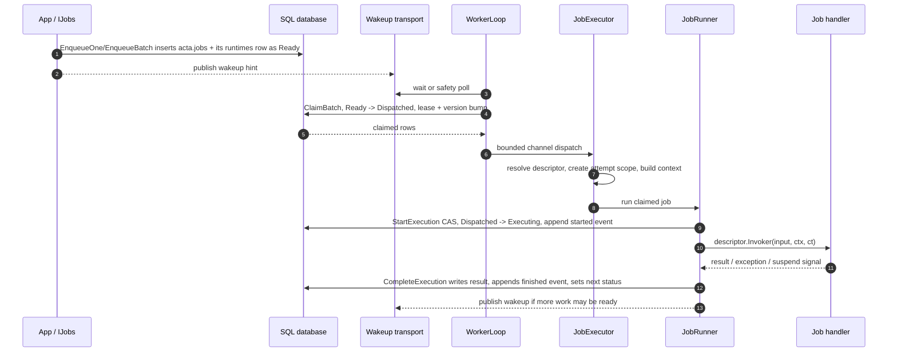
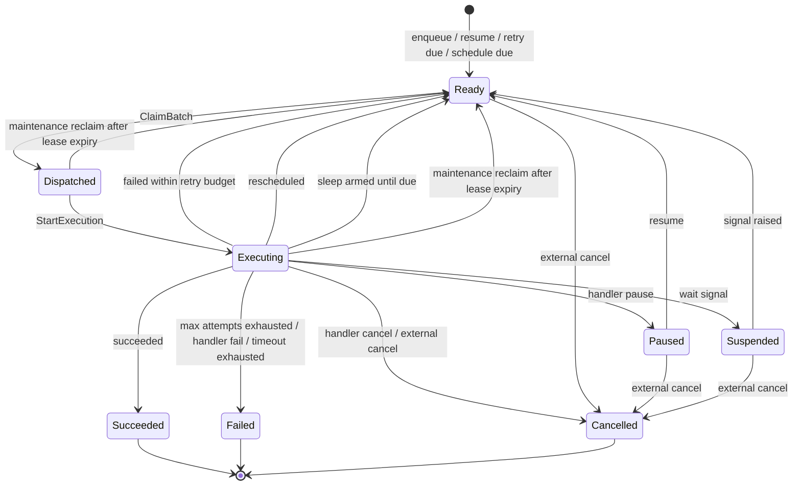
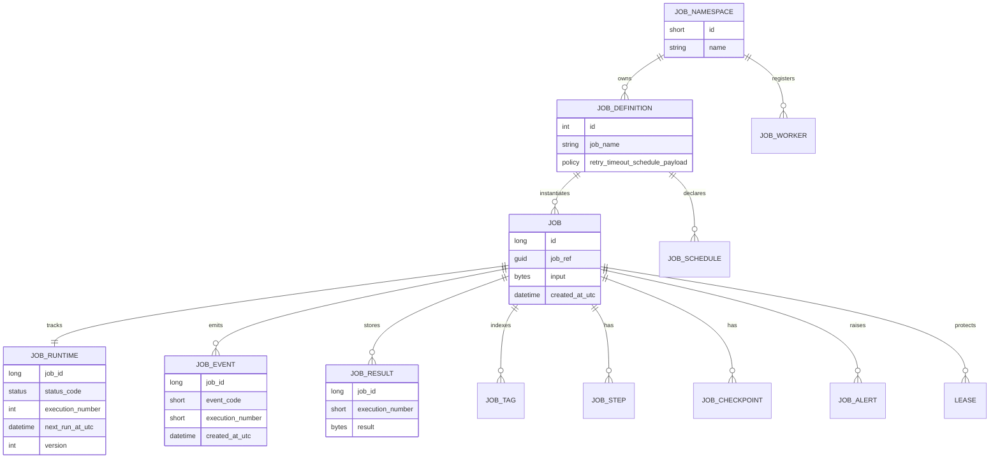
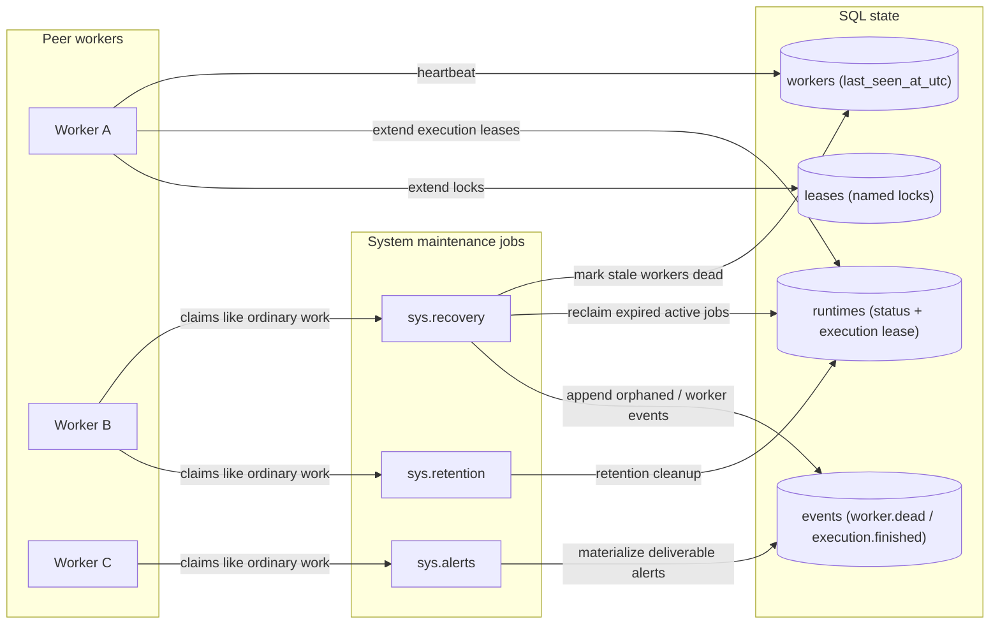

# Architecture diagrams

Diagram-first map of Acta: work flow, durability, and leaderless coordination. This visualizes the
model defined in [`concepts.md`](../guide/concepts.md); the rationale is in [`design.md`](../internals/design.md).

## Diagram inventory

| # | Diagram | Question it answers |
|---:|---|---|
| 1 | System context | What external pieces exist, and what does Acta own? |
| 2 | Runtime composition | Which runtime collaborators own which responsibilities? |
| 3 | Claim -> dispatch -> execute -> complete | What happens to one job attempt? |
| 4 | Job lifecycle state machine | Which states can a job occupy and why? |
| 5 | Persistence model tiers | Which tables are core work units, internal substrate, catalog, and operator views? |
| 6 | Maintenance and recovery | What happens after crashes, stale leases, dead workers, and retention windows? |

The conceptual model (four claims, the three identities, durable slots) lives in
[`design.md`](../internals/design.md) and [`concepts.md`](../guide/concepts.md); this doc shows the
runtime and persistence spine rather than re-stating it.

## 1. System context

### Key points

- The SQL database is the durable coordination boundary.
- Operators and Acta runtime read the same tables.
- Wakeup is an optimization, not the source of truth.
- Workers are peers; there is no supervisor, scheduler daemon, or leader process.

## 2. Runtime composition

### Key points

- `WorkerRuntime` is a facade/composition root, not the engine itself.
- `WorkerLoop` owns claiming and concurrency fan-out.
- `JobExecutor` prepares one already-claimed job attempt.
- `JobRunner` owns the start -> invoke -> complete attempt lifecycle.
- `WorkerHeartbeat` is intentionally independent of executor throughput so long-running handlers do not starve lease extension.

## 3. Claim -> dispatch -> execute -> complete

### Key points

- The claim is the competitive admission point.
- `StartExecution` uses a version/CAS guard so stale attempts cannot start after the row has moved on.
- The event ledger gets paired execution-started and execution-finished events for attempts.
- Completion owns retry, terminal-state, recurring rollover, result persistence, and wakeup implications.

## 4. Job lifecycle state machine

### Key points

- `Ready` is the only claimable state.
- `Dispatched` and `Executing` are active lease-owned states.
- `Succeeded`, `Failed`, and `Cancelled` are terminal states.
- `Suspended` means waiting on an external signal; sleep/reschedule can also re-arm as `Ready` with a future due time.
- The execution outcome (`Succeeded`, `Failed`, `Orphaned`, `Rescheduled`, `Suspended`, `Paused`, etc.) is recorded in the execution ledger.

## 5. Persistence model tiers

### Key points

- `jobs` is the only independently claimable work unit; its mutable runtime state (status, cursor, CAS version) lives on the 1:1 `runtimes` row.
- `events` is both lifecycle timeline and execution ledger.
- Internal substrate tables (`steps`, `checkpoints` for variables/signals/timers/progress) hang off a parent job and share its claim, lease, retry, cancellation, and audit lifecycle; they are never separately claimable.
- Catalog tables describe what can run; worker tables describe who is alive; operator tables describe alerts and controls.
- The full column-level model is generated in [`data-model.md`](../reference/data-model.md).

## 6. Maintenance and recovery

### Key points

- Maintenance is work, not leadership.
- Any peer can claim maintenance jobs through the same durable claim path as user jobs.
- Stale workers are detected through heartbeat state.
- Expired leases cause orphan/reclaim behavior; handlers still own side-effect idempotency.

## Review checklist for diagram drift

Before publishing a release, verify these diagrams still match source:

- Job statuses and execution statuses still match the code families.
- `WorkerRuntime`, `WorkerLoop`, `JobExecutor`, `JobRunner`, and `WorkerHeartbeat` still own the responsibilities shown here.
- The persistence diagram still matches [`data-model.md`](../reference/data-model.md) and the generated migrations.
- Maintenance jobs are still ordinary jobs claimed through the normal path.
- Provider parity is still tested through shared conformance specs for both SQL Server and Postgres.
